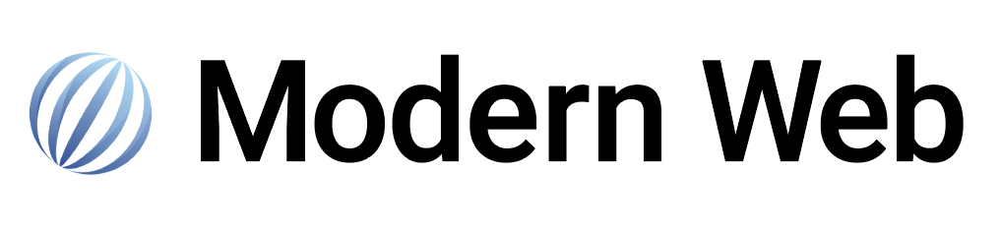

  

  
  

  <a href="https://modern-web.dev">Website</a>
  ·
  <a href="https://modern-web.dev/guides/">Guides</a>
  ·
  <a href="https://modern-web.dev/docs/">Documentation</a>

<h1></h1>

**Guides, tools and libraries for modern web development!**

- **Built on web standards:** Work with and extend what's available in modern browsers, learning skills, and writing code that stays relevant.
- **Lightweight:** Simple solutions that are lightweight and have a low barrier to entry. With extension points for power users.
- **Low complexity:** Write code that is close to what actually runs in the browser, reducing abstractions and complexity.

  <a href="https://modern-web.dev/guides/"><strong>Explore the Modern Web Guides&nbsp;&nbsp;▶</strong></a>

## The goal for Modern Web

> Our goal is to provide developers with the guides and tools they need to build for the modern web. We aim to work closely with the browser and avoid complex abstractions.

Modern browsers are **a powerful platform** for building websites and applications. We try to work with what's available in the browser first before reaching for custom solutions.

When you're **working with the browser** rather than against it, code, skills, and knowledge remain relevant for a longer time. Development becomes faster and debugging is easier because there are fewer layers of abstractions involved.

At the same time, we are aware of the fact that not all problems can be solved elegantly by the browser today. We **support developers** making informed decisions about introducing tools and customizations to their projects, in such a way that developers can upgrade later as browser support improves.

If you wanna know more see our [Announcement Blog Post](https://modern-web.dev/blog/introducing-modern-web/).

## Our Products

- [Web Test Runner](https://modern-web.dev/docs/test-runner/overview/)
- [Web Dev Server](https://modern-web.dev/docs/dev-server/overview/)

There is much, much more to come so follow us on [Twitter](https://twitter.com/modern_web_dev).

## 🤝 Contributing

We are always looking for contributors of all skill levels! If you're looking to ease your way into the project, try out a [good first issue](https://github.com/modernweb-dev/web/issues?q=is%3Aissue+is%3Aopen+label%3A%22good+first+issue%22).

If you are interested in helping contribute to Modern Web, please take a look at our [Contributing Guide](https://github.com/modernweb-dev/web/blob/master/CONTRIBUTING.md). Also, feel free to drop into [Slack](https://modern-web.dev/discover/slack/) and say hi. 👋

## Sponsored by

Become a sponsor and help us sustain our community. [[Contribute](https://opencollective.com/modern-web/contribute)]

## Supported by

---

