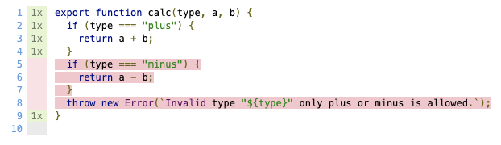

We are incredible proud to announce our latest web improvements. We call it "Modern Web".

## What is Modern Web?

Modern Web will host all developer tools which are to general to be only on [Open Web Components](https://open-wc.org).

We are same Open Web Components developers but we split the general modern web development related topics away from the web components specifics.

You can find our new home at [modern-web.dev](https://modern-web.dev). All our tools are available on npm within the [@web](https://www.npmjs.com/org/web) npm namespace. Our code is open source and on [github.com/modernweb-dev/web](https://github.com/modernweb-dev/web). For updates you can follow us on [Twitter](https://twitter.com/modern_web_dev).

## What we stands for

### Low barrier to entry

Tooling that works out of the box and seldomly requires configuration. Knowledge of HTML, CSS and JS should be all you need. We go back to the old days where we wrote html we understood. Include some scripts and link some css and you are ready to go. No longer do you need a degree in Webpack to deploy an application.

### Performance

We care about performance and therefore we encourage to ship as little code to your users as possible.
By utilizing what the modern browser offers out of the box to minimize user code.
Combining this with tools that understand html/css/js we can produce small high performant websites.

### Close to the browser

Following the browser ensures that your knowledge and skill remain relevant over time. Frameworks may come and go, but the browser stays.
This means that we value browser solutions over tooling that goes into the opposite direction.

## Our vision of the future

Modern Web is our starting point into a list of tools that will enable you to create websites as a mere mortal human.
In the end we will offer a complete set of tools to enable building modern websites for and with the browser.

Our tools are generally comprised of many individual parts/plugins/packages. Each of those packages tries to cover the smallest possible feature set but still solving an isolated problem domain. You may find these smaller packages useful but generally we advice to consume our opinionated and more user friendly packages.

Each of our opinionated tools will come with a learning section that guides you step by step into using the specific tool. Furthermore there will be a comprehensive documentation for each of those tool and also for all the different parts/plugins/packages it's made of.

We start off our journey with a brand new `Web Test Runner` that actually uses the browser as we see that as the area with the biggest gap.

## Web Test Runner

The test runner for web applications.

👉&nbsp;&nbsp; Headless browsers with puppeteer, playwright, or selenium. <br>
🚧&nbsp;&nbsp; Reports logs, 404s, and errors from the browser. <br>
📦&nbsp;&nbsp; Supports native es modules.<br>
🔧&nbsp;&nbsp; Runs tests in parallel and isolation.<br>
👀&nbsp;&nbsp; Interactive watch mode.<br>
🏃&nbsp;&nbsp; Reruns only changed tests.<br>
🚀&nbsp;&nbsp; Powered by [esbuild](https://modern-web.dev/docs/dev-server/esbuild.md) and [rollup plugins](https://modern-web.dev/docs/dev-server/rollup.md)

### Why a new test runner?

One of our core principals is to be close to the browser. Therefore our tests should run in a browser.
You may ask why? and it might not be totally obvious but JavaScript in Node and in the Browser are two totally different eco systems and implementation.
This leads to a diversion in what is supported. One of the most prominent examples is probably ES Modules. While supported in all evergreen browsers in early 2018 there are still some road bump for node in 2020.

Giving this situation there will always be a difference in pace and possibilities in regards to node/JsDom and a real browser.
On top of that there are quite often subtle variations in implementation for each browser.
So it's good to know if it runs in the actual browser your users are going to use. And to be honest not a single user will use JsDom.

## Quick Start

This is the minimal instruction on how to start using the test runner.

1. Install the test runner

   ```bash
   npm i -D @web/test-runner @open-wc/testing
   ```

2. Add a script to your `package.json`

   ```json
   {
     "scripts": {
       "test": "web-test-runner \"test/**/*.test.js\" --node-resolve",
       "test:watch": "web-test-runner \"test/**/*.test.js\" --node-resolve --watch"
     }
   }
   ```

3. Create a test file `test/sum.test.js`.

   ```js
   import { expect } from '@open-wc/testing';
   import { sum } from '../src/sum.js';

   it('sums up 2 numbers', () => {
     expect(sum(1, 1)).to.equal(2);
     expect(sum(3, 12)).to.equal(15);
   });
   ```

4. Create the src file `src/sum.js`

   ```js
   export function sum(a, b) {
     return a + b;
   }
   ```

5. Run it

   ```bash
   $ npm run test
   $ web-test-runner test/**/*.test.js --coverage --node-resolve

   Chrome: |██████████████████████████████| 1/1 test files | 1 passed, 0 failed

   Test coverage: 100 %
   View full coverage report at coverage/lcov-report/index.html

   Finished running tests in 0.9s, all tests passed! 🎉
   ```

See more instructions in the [getting-started](https://modern-web.dev/learn/test-runner/getting-started/) learn section.

## Watch and debug

Once you have the basics test running you can enjoy some of the more advanced features.

The same tests are run in watch mode but you do get multiple additional features

- Tests are rerun on file change (source or test)
- You can focus a specific test file
- You can open a test file in the browser

Automatic rerunning is probably well know but what does it mean to "focus a specific test file"?
I'm glad you asked as it is one of the key features when working with many test files.
Often when working you want to focus only on ONE specific test file and with web test runner you can do that right in the terminal.

Start the test runner in watch mode and you will get a menu at the bottom

```
Finished running tests, watching for file changes...

Press F to focus on a test file.
Press D to debug in the browser.
Press Q to quit watch mode.
Press Enter to re-run all tests.
```

Now if you use F a menu will present itself with all the files you can focus

```
[1] test/calc.test.js
[2] test/sum.test.js
[3] test/multiply.test.js

Number of the file to focus: 2
```

Once a test file is focused you can also open it directly in the browser.

See more instructions in the [watch-and-debug](https://modern-web.dev/learn/test-runner/watch-and-debug/) learn section.

## Test in multiple browsers using playwright

If we want to run tests in all evergreen browser then [Microsoft Playwright](https://github.com/microsoft/playwright) might be for us.

We can install it via

```bash
npm i -D @web/test-runner-playwright
```

which will bring its on versions of chromium, firefox, and WebKit.

Once that is available we will activate via some flags in the command of the packages.json

```json
"test": "web-test-runner \"test/**/*.test.js\" --node-resolve --playwright --browsers chromium firefox webkit",
```

Now all that is left to start this bad boy.

```
$ yarn test
$ web-test-runner "test/**/*.test.js" --node-resolve --playwright --browsers chromium firefox webkit

Chromium: |██████████████████████████████| 2/2 test files | 3 passed, 0 failed
Firefox:  |██████████████████████████████| 2/2 test files | 3 passed, 0 failed
Webkit:   |██████████████████████████████| 2/2 test files | 3 passed, 0 failed

Finished running tests in 3.4s, all tests passed! 🎉
```

We execute 2 test files in 3 different real browsers.
If everything is green you can't get any more confident about your code. So ship it.

See more instructions in the [using-launchers](https://modern-web.dev/learn/test-runner/using-launchers/) learn section.

## Testing responsive views

With the world going mobile first there needs to be a way of testing your mobile views.
Working with a real browser you can directly change the viewport.

Let's assume we have some code that should only execute on mobile.
It would be nice to have some sort of functionality to check for it.

How about a function `isMobile()` and it returns true/false.

```js
describe('isMobile', () => {
  it('returns true if width < 1024px', async () => {
    expect(isMobile()).to.be.true;
  });

  it('returns false if width > 1024px', async () => {
    expect(isMobile()).to.be.false;
  });
});
```

It feels like something is missing in this test... 🤔
Expecting something to be true in once case and false in another without any other function call feels wrong.
Right we are missing a way to change the actual size of the window.

For that we need to install the library:

```bash
npm i -D @web/test-runner-helpers
```

With that we get a `setViewport` method which we can put to good use.

```js
import { expect } from '@open-wc/testing';
import { setViewport } from '@web/test-runner-helpers';
import { isMobile } from '../src/isMobile';

describe('isMobile', () => {
  it('returns true if width < 1024px', async () => {
    await setViewport({ width: 360, height: 640 });
    expect(isMobile()).to.be.true;
  });

  it('returns false if width > 1024px', async () => {
    await setViewport({ width: 1200, height: 640 });
    expect(isMobile()).to.be.false;
  });
});
```

If you wanna know more like for example how to test css media queries see the [responsive](https://modern-web.dev/learn/test-runner/responsive/) learn section.

## Using Code Coverage

Once you have a decent set of tests you may want to look into what could still be improved.
Code coverage can help to find which code segments have not yet been tested.
Generally it's advised to have a code coverage at above 80% which you will most likely have if you practice Test Driven Development (TDD).

## Getting the test coverage

Coverage is part of the default feature set that comes with any launcher that works with chromium.

The reason for that is that the chromium browser itself calculates the coverage for us.

1. Add a script to your `package.json`
   ```json
   {
     "scripts": {
       "test": "web-test-runner \"test/**/*.test.js\" --node-resolve --coverage"
     }
   }
   ```

But before we can gather coverage we need to have some source code and tests.

As good citizens we start with the tests first

👉 `test/calc.test.js`

```js
import { expect } from '@open-wc/testing';
import { calc } from '../src/calc.js';

it('does plus for 2 numbers', () => {
  expect(calc('plus', 1, 1)).to.equal(2);
  expect(calc('plus', 3, 12)).to.equal(15);
});
```

and then the actual implementation

```js
export function calc(type, a, b) {
  if (type === 'plus') {
    return a + b;
  }
}
```

And while we are at it we can also add `minus`, I'm sure that will come in handy that at some point as well.
And if we provide a wrong type we should throw an error - better let the user know whats up.

👉 `src/calc.js`

```js
export function calc(type, a, b) {
  if (type === 'plus') {
    return a + b;
  }
  if (type === 'minus') {
    return a - b;
  }
  throw new Error(`Invalid type "${type}" only plus or minus is allowed.`);
}
```

So let's run our test

```
$ yarn test
$ web-test-runner "test/**/*.test.js" --node-resolve --coverage

Chrome: |██████████████████████████████| 1/1 test files | 1 passed, 0 failed

Test coverage: 69.45 %
View full coverage report at coverage/lcov-report/index.html

Finished running tests in 1s, all tests passed! 🎉
```

As you can see, our test passed but our `Test coverage` is a bit on the low side.

## What to test

We might have a test, but we don't test all variations that can happen within the function.

In order to see what is missing we can look at the Coverage Report by `Command + Click`-ing on the link (coverage/lcov-report/index.html) in the console.

There, it will show us that `calc.js` has a yellow coverage and if we click on it we can see the detailed code and what is missing.



As you can see, we didn't test `minus` or what happens if an error is thrown.

Let's add some tests for the `minus` function.

```js
it('does minus for 2 numbers', () => {
  expect(calc('minus', 3, 1)).to.equal(2);
});
```

It gives use a test coverage of `86.11 %`.

Adding a test for throwing an error will bring it to `100%`.

See more instructions in the [code-coverage](https://modern-web.dev/learn/test-runner/code-coverage/) learn section.

## Supporting TypesScript and JSX via esbuild

...

See more instructions in the [typescript-jsx-esbuild](https://modern-web.dev/learn/test-runner/typescript-jsx-esbuild/) learn section.

## Enable your needs with custom plugins

...

See more instructions in the [writing-plugin](https://modern-web.dev/learn/test-runner/writing-plugin/) learn section.

## Summary

There you have it - our first modern-web product enabling you to efficiently test and debug with a real browser.

You can find us at [modern-web.dev](https://modern-web.dev). All our tools are available on npm within the [@web](https://www.npmjs.com/org/web) npm namespace. Our code is open source and on [github.com/modernweb-dev/web](https://github.com/modernweb-dev/web). For updates you can follow us on [Twitter](https://twitter.com/modern_web_dev).

## What this means for Open Web Components

We see this as a win-win as `Open Web Components` can fully focusing on web components while `Modern Web` will provide us with everything needed for modern web development.
