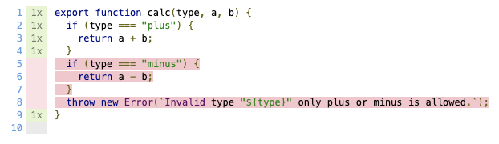

# Test Runner >> Code Coverage ||50

Once you have a decent set of tests you may want to look into what could still be improved.
Code coverage can help to find which code segments have not yet been tested.
Generally it's advised to have a code coverage at above 80% which you will most likely have if you practice Test Driven Development (TDD).

## Getting the code coverage

To see the code coverage of our tests, all we need to do use run the test runner with the `--coverage` flag. It's a bit slower than the regular test run, so we don't enable it by default.

1. Add a script to your `package.json`
   ```json
   {
     "scripts": {
       "test": "web-test-runner \"test/**/*.test.js\" --node-resolve --coverage"
     }
   }
   ```

But before we can gather coverage we need to have some source code and tests.

As good citizens we start with the tests first

👉 `test/calc.test.js`

```js
import { expect } from '@esm-bundle/chai';
import { calc } from '../src/calc.js';

it('does plus for 2 numbers', () => {
  expect(calc('plus', 1, 1)).to.equal(2);
  expect(calc('plus', 3, 12)).to.equal(15);
});
```

and then the actual implementation

```js
export function calc(type, a, b) {
  if (type === 'plus') {
    return a + b;
  }
}
```

And while we are at it we can also add `minus`, I'm sure that will come in handy that at some point as well.
And if we provide a wrong type we should throw an error - better let the user know what's up.

👉 `src/calc.js`

```js
export function calc(type, a, b) {
  if (type === 'plus') {
    return a + b;
  }
  if (type === 'minus') {
    return a - b;
  }
  throw new Error(`Invalid type "${type}" only plus or minus is allowed.`);
}
```

So let's run our test

```
$ npm run test
$ web-test-runner "test/**/*.test.js" --node-resolve --coverage

Chrome: |██████████████████████████████| 1/1 test files | 1 passed, 0 failed

Code coverage: 69.45 %
View full coverage report at coverage/lcov-report/index.html

Finished running tests in 1s, all tests passed! 🎉
```

As you can see, our test passed but our code coverage is a bit on the low side.

## What to test

We might have a test, but we don't test all variations that can happen within the function.

In order to see what is missing we can look at the Coverage Report by `Command + Click`-ing on the link (coverage/lcov-report/index.html) in the console.

There, it will show us that `calc.js` has a yellow coverage and if we click on it we can see the detailed code and what is missing.



As you can see, we didn't test `minus` or what happens if an error is thrown.

Let's add some tests for the `minus` function.

```js
it('does minus for 2 numbers', () => {
  expect(calc('minus', 3, 1)).to.equal(2);
});
```

It gives use a code coverage of `86.11 %`.

Adding a test for throwing an error will bring it to `100%`.

## Adding more features

Let's add the possibility to `multiply`.
While implementing, Lea said it's time for a meeting so we put `return; // finish later` for now.

👉 `src/calc.js`

```js
export function calc(type, a, b) {
  if (type === 'plus') {
    return a + b;
  }
  if (type === 'minus') {
    return a - b;
  }
  if (type === 'multiply') {
    return; // finish later
  }
  throw new Error(`Invalid type "${type}" only plus, minus or multiply is allowed.`);
}
```

After the meeting it was time for lunch and when we came back to the code you forgot where we left of.
I think it was with the tests

Yeah let's finish those

👉 `test/calc.test.js`

```js
it('does multiply for 2 numbers', () => {
  calc('multiply', 3, 3);
});
```

Run it

```
$ npm run test
$ web-test-runner "test/**/*.test.js" --node-resolve --coverage

Chrome: |██████████████████████████████| 1/1 test files | 4 passed, 0 failed

Code coverage: 100 %
View full coverage report at coverage/lcov-report/index.html

Finished running tests in 1s, all tests passed! 🎉
```

Uh, nice `100%` - but it feels fishy? Didn't we have a `finish later` somewhere?

## How come we have 100% code coverage?

Let's first try to understand how code coverage works.

The way code coverage gets measured is by applying a form of instrumentation. In short, before our code is executed it gets changed (instrumented) and it behaves something like this:

```js
// Note: This is a super simplified version for illustration purposes.
if (this.value === 'cat') {
  console.log('We like cats too :)');
}

// becomes something like this (pseudo code)
__instrumented['functionUpdate'] += 1;
if (this.value === 'cat') {
  __instrumented['functionUpdateBranch1yes'] += 1;
  console.log('We like cats too :)');
} else {
  __instrumented['functionUpdateBranch1no'] += 1;
}
```

In short, your code gets littered with many many flags. Based on which flags get trigger a statistic gets created.

So 100% code coverage only means that every line you have in your code was executed at least once after all your tests finished. It does not mean that you tested everything, or if your tests make the correct assertions.

What happened in our case?

We called the `calc` with `multiply` but we forgot to put an assertion. So the correct code branch was executed but that it returned nothing we didn't test.

So we can correct our test

```js
it('does multiply for 2 numbers', () => {
  expect(calc('multiply', 3, 3)).to.equal(9);
});
```

```
test/calc.test.js:

 ❌ does multiply for 2 numbers
      at: test/calc.test.js:20:37
      AssertionError: expected undefined to equal 9
        at n.<anonymous> (test/calc.test.js:20:37)

Chrome: |██████████████████████████████| 1/1 test files | 3 passed, 1 failed

Code coverage: 100 %
View full coverage report at coverage/lcov-report/index.html
```

We now have a failing test but still 100% code coverage.

You should, therefore, see code coverage as a tool that only gives you guidance and help on spotting missing tests, rather than a hard guarantee of code quality.

## Ignoring uncovered lines

In more complex applications, it is likely that you will find yourself creating difficult, if not impossible, to test branches of functionality. While this can absolutely be a pointer to logic that is worth breaking down into more approachable parts, there will be cases where this is not feasible. If so, you may chose to ignore a line of code by using the `/* c8 ignore next */` custom comment. Using this, or more advanced forms of [ignoring uncovered lines](../../../docs/test-runner/writing-tests/code-coverage.md#ignoring-uncovered-lines) while computing code coverage can go a long way in preparing your project for long term maintenance.

## Coverage browser support

The default coverage of the test runner uses the ability of Chromium to do native code coverage instrumentation. This gives us the best speed. When testing multiple browsers this should still be fine, you don't need to get code coverage from all browsers. One browser is usually enough.

If you need to collect coverage from all browsers, or if you're not testing for Chromium at all, you can look into alternative ways of instrumenting your code. Check the [coverage docs](../../../docs/test-runner/writing-tests/code-coverage.md) to learn more about that.

## Learn more

All the code is available on [github](https://github.com/modernweb-dev/example-projects/tree/master/guides/test-runner).
See the [documentation of @web/test-runner](../../../docs/test-runner/overview.md).
