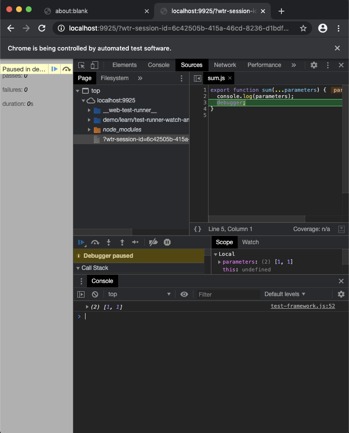

# Test Runner >> Watch and Debug ||20

During development, it can be annoying to re-run all your tests manually every time there is a change.
Watch mode helps by watching the file system, re-running the tests that have changes, and reporting the updated results.

## Triggering watch mode

Add a script `test:watch` to your `package.json`.

```json
{
  "scripts": {
    "test": "web-test-runner \"test/**/*.test.js\" --node-resolve",
    "test:watch": "web-test-runner \"test/**/*.test.js\" --node-resolve --watch"
  }
}
```

If you want to run the test once use `npm run test`. If you want to run them continuously use `npm run test:watch`.

## Watch Features Overview

The same tests are run in watch mode but you do get multiple additional features

- Tests are rerun on file change (source or test)
- You can focus a specific test file
- You can open a test file in the browser for debugging

### Preparation

To see the benefit we start off with the code from [Getting Started](../getting-started.md) and add a new feature to our code.

We want to be able to pass in a string like `1 + 2 + 3` to get its sum.

👉 `test/calc.test.js`

```js
import { expect } from '@esm-bundle/chai';
import { calc } from '../src/calc.js';

it('calculates sums', () => {
  expect(calc('1 + 1 + 1')).to.equal(3);
  expect(calc('2 + 6 + 12')).to.equal(20);
});
```

👉 `src/calc.js`

```js
import { sum } from './sum.js';

export function calc(inputString) {
  return sum(inputString.split('+'));
}
```

We want to reuse our `sum` function, but we need to enhance it to allow for 3 numbers. Let's add a failing test for it.

👉 `test/sum.test.js`

```js
it('sums up 3 numbers', () => {
  expect(sum(1, 1, 1)).to.equal(3);
  expect(sum(3, 12, 5)).to.equal(20);
});
```

## Focus

When we run our tests in watch mode now, we will see 2 failing tests.

```
$ npm run test:watch

test/calc.test.js:

 ❌ calculates sums
      AssertionError: expected '1 , 1 , 1undefined' to equal 3
        at n.<anonymous> (test/calc.test.js:5:32)

test/sum.test.js:

 ❌ sums up 3 numbers
      at: test/sum.test.js:10:27
      error: expected 2 to equal 3
      + expected - actual

      -2
      +3

Chrome: |██████████████████████████████| 2/2 test files | 1 passed, 2 failed

Finished running tests, watching for file changes...

Press F to focus on a test file.
Press D to debug in the browser.
Press Q to quit watch mode.
Press Enter to re-run all tests.
```

Ok, let's get started on making it work.
We can add a console log to see the parameters.

👉 `src/sum.js`

```js
export function sum(...parameters) {
  console.log(parameters);
}
```

```
test/calc.test.js:

 🚧 Browser logs:
    > [ [ '1 ', ' 1 ', ' 1' ] ]

 ❌ calculates sums
      AssertionError: expected undefined to equal 3
        at n.<anonymous> (test/calc.test.js:5:32)

test/sum.test.js:

 🚧 Browser logs:
    > [1, 1]
    > [1, 1, 1]

 ❌ sums up 2 numbers
      AssertionError: expected undefined to equal 2
        at n.<anonymous> (test/sum.test.js:5:24)

 ❌ sums up 3 numbers
      AssertionError: expected undefined to equal 3
        at n.<anonymous> (test/sum.test.js:10:27)

Chrome: |██████████████████████████████| 2/2 test files | 0 passed, 3 failed
```

This adds a lot of noise since we get the logs from all our test files. For larger projects with a lot of tests, this really adds up.
We don't want to work on `sum` and `calc` at the same time, it's better if we can focus on fixing one test file at a time.
To do that, we can hit `F` to open the Focus Menu. Then we can choose which file we want to focus on. We choose `2` and hit `Enter`.

```
[1] test/calc.test.js
[2] test/sum.test.js

Number of the file to focus: 2
```

We are back in the test output mode but only the focused test file is shown.

```
test/sum.test.js:

 🚧 Browser logs:
    > [1, 1]
    > [1, 1, 1]

 ❌ sums up 2 numbers
      AssertionError: expected undefined to equal 2
        at n.<anonymous> (test/sum.test.js:5:24)

 ❌ sums up 3 numbers
      AssertionError: expected undefined to equal 3
        at n.<anonymous> (test/sum.test.js:10:27)

Chrome: |██████████████████████████████| 1/1 test files | 0 passed, 2 failed
```

So that's better, but we're still seeing two tests. That's because focus works only with individual files.
To focus on a test with a file we can add `.only` to our test:

👉 `test/sum.test.js`

```js
it.only('sums up 2 numbers', () => {
  expect(sum(1, 1)).to.equal(2);
  expect(sum(3, 12)).to.equal(15);
});
```

_If you wish to ignore a test you can put `.skip` on it_

Now we're talking!

```
test/sum.test.js:

 🚧 Browser logs:
    > [1, 1]

 ❌ sums up 2 numbers
      AssertionError: expected undefined to equal 2
        at n.<anonymous> (test/sum.test.js:5:24)

Chrome: |██████████████████████████████| 1/1 test files | 0 passed, 1 failed
```

👆 even though we have 2 `sum` calls in our test we only have one console log? The reason for that is that as soon as one `expect` fails the execution for that test stops. So `sum(3, 12)` never gets executed.

With the ability to log outputs of specific individual executions of `sum` we could surely make the code work.
But to highlight alternative approaches, we will be looking into debugging in the browser as well.

PS: Even though some people might say using `console.log` is not debugging don't be afraid to use it often. It is good enough and usually faster than firing up an actual debugger.

PPS: Logging quick tip: You can use `console.log({ foo })` to quickly log (multiple) variables with a name. (beats writing `console.log('foo', foo)`)

## Debug

When working on code it can be useful to be able to stop the code execution in the browser itself.
This will give you access to all the awesome built-in browser dev tools.

How we can do that?

As with before we run the tests in watch mode and focus on a specific file.
Once you have that all you need to do is hit `D`.

It opens the browser with the focused test file.

Now to "pause" the actual code execution, we can add a `debugger` statement into our code.

👉 `src/sum.js`

```js
export function sum(...parameters) {
  console.log(parameters);
  debugger;
}
```

Once we refresh the browser window it will now stop at the `debugger` statement.

In Chrome it looks something like this.



Now we are in control of our execution and we can inspect variables or start stepping through the code line by line.

## Finish implementation

Whether you used logs or debugger at some point tests will start to turn green 💪

We fixed the `sum` function like this

👉 `src/sum.js`

```js
export function sum(...numbers) {
  let sum = 0;
  for (const number of numbers) {
    sum += number;
  }
  return sum;
}
```

👆 yes `reduce` could have been used here but a loop is easier to read and explain (and we are in the guides section after all).

Now that our test is green we remove the `.only` to run all tests in our focused file.

```
Chrome: |██████████████████████████████| 1/1 test files | 2 passed, 0 failed

Finished running tests, watching for file changes...

Focused on test file: test/sum.test.js
```

We will now leave the focus mode by hitting `Esc` to run all tests.

Not surprisingly we still have an open failing test.

```
test/calc.test.js:

 🚧 Browser logs:
    > { numbers: [[1 ,  1 ,  1]] }

 ❌ calculates sums
      AssertionError: expected '01 , 1 , 1' to equal 3
        at n.<anonymous> (test/calc.test.js:5:32)

Chrome: |██████████████████████████████| 1/1 test files | 0 passed, 1 failed
```

👆 we kept a `console.log({ numbers });` in our `sum.js`

The issue seems to be that we pass on an array instead of individual parameters to `sum`.

👉 `src/calc.js`

```js
export function calc(inputString) {
  const numbers = inputString.split('+').map(number => parseInt(number));
  return sum(...numbers);
}
```

👆 We needed to convert the string values to numbers and then spread it into sum.

And we are done 👍

When we do a regular test run, we get:

```
Chrome: |██████████████████████████████| 2/2 test files | 3 passed, 0 failed

Finished running tests in 1s, all tests passed! 🎉
```

## Learn more

All the code is available on [github](https://github.com/modernweb-dev/example-projects/tree/master/guides/test-runner).
See the [documentation of @web/test-runner](../../../docs/test-runner/overview.md).
